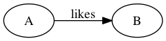
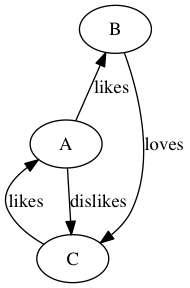
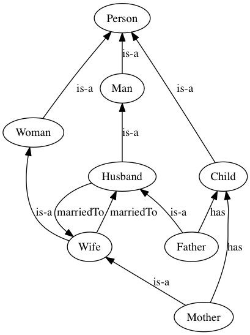

pygraph 
=======

pygraph creates simple and quick `Directed Graphs` using relational sentences (knowledge base). It uses [pydot](https://pypi.python.org/pypi/pydot/1.0.28) for rendering the graphs.

The concept of this module is based on the ontological relationships, or Linked Data. 
 
 Means we don't need to create nodes then link them to one another separately, 
 but instead we will introduce new relations between nodes through statements, let's call them `relation statements`.
 
 For example, the relation statement `A likes B` this will be translated into a graph (fig. below) with two nodes `A` and `B` where the link (edge) 
between them is directed from `A` to `B` with the label `likes`. 




## How to use:

New relation statements can be introduced in two ways 

1. module level by using `add_relation('A likes B')` method, or 
2. from an external file where multiple relation statements can be parsed at once.

#### Example:

1) module level entry example:

```python
import sys
sys.path.append("../../pygraph")
from pygraph.dgraph import PyGraph

g = PyGraph()

g.add_relation('A likes B')
g.add_relation('A dislikes C')
g.add_relation('B loves C')
g.add_relation('C likes A')

g.draw_graph()

```
will produce:




2) Or you can read relations directly from an external file and pass its `path` as an argument for `pygraph/dgraph.py`.

e.g.

file name `kb-person.csv` and its contents:

```raw
Man is-a Person
Woman is-a Person
Child is-a Person
Father has Child
Mother has Child
Mother is-a Wife
Father is-a Husband
Husband marriedTo Wife
Wife marriedTo Husband
Husband is-a Man
Wife is-a Woman
```

Run:

`$ python pygraph/dgraph.py example/dataset/kb-person.csv` 

will produce the following:



For help and options see `$ python pygraph/dgraph.py -h`

## Requirements:

- pydot 1.0.2+


## To know:

- Repeated relations between the same nodes are ignored.
- Output will be saved into an output folder `pygraph-output`.
- You may specify the delimiter in sentences (default is one space " "). 
- Tested on Python 2.7.6 and 3.4.2
- To install `pydot` for:
	- python 3+ see [James Mills](https://code.google.com/p/pydot/#Support_for_Python_3) branch.
	- python 2 try `$ pip install pydot` or `$ sudo pip install pydot`

## TO DO:

- Test unit to validate the input `relation sentences`.
- Add more arguments to `argparse` options.
- Add `setup.py` and `requirements.txt` for installation.
- Extend to more graph types.
