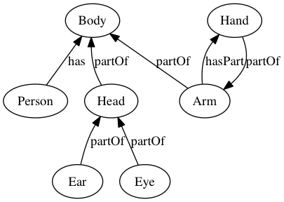

Say you have the following relation statements

```raw
Person has Body
Arm partOf Body
Hand partOf Arm
Arm hasPart Hand
Head partOf Body
Ear partOf Head
Eye partOf Head
```

In the file

`dataset/kb-body.csv`


    from pygraph import dgraph

Create a graph instance


    g = dgraph.PyGraph()

Read the relation statements from the file


    g.file_relations('dataset/kb-body.csv')

Here how it looks after we read them:


    g.graph_dict


    {'Arm': [('Hand', 'partOf')],
     'Body': [('Person', 'has'), ('Arm', 'partOf'), ('Head', 'partOf')],
     'Ear': [],
     'Eye': [],
     'Hand': [('Arm', 'hasPart')],
     'Head': [('Ear', 'partOf'), ('Eye', 'partOf')],
     'Person': []}


Now lets visualize that:


    g.draw_graph("ex3")

Here we go:


