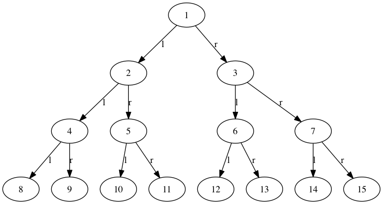

Say you have the following relation statements

```raw
Person has Body
Arm partOf Body
Hand partOf Arm
Arm hasPart Hand
Head partOf Body
Ear partOf Head
Eye partOf Head
```

In the file

`dataset/kb-body.csv`

```python
from pygraph import dgraph
```

Create a graph instance

```python
g = dgraph.PyGraph()
```
Read the relation statements from the file

```python
g.file_relations('dataset/kb-body.csv')
```

Here how what it looks like after parsing them:

```python
print(g.graph_dict)
```

     {'Body': [], 
      'Head': [('partOf', 'Body')], 
      'Eye': [('partOf', 'Head')], 
      'Hand': [('partOf', 'Arm')], 
      'Person': [('has', 'Body')], 
      'Ear': [('partOf', 'Head')], 
      'Arm': [('partOf', 'Body'), ('hasPart', 'Hand')]}


Now lets visualize that:

```python
g.draw_graph("ex3")
```


Here we go:


<hr>

### Drawing Binary Tree

You can draw a binary tree too! 


```python
from pygraph import dgraph

def binary_tree(i, limit=7): 
	"""for a complete tree, try limits: 1, 3, 7, 15, 31, 63, 127, 255 .. etc"""

	node = i
	left = 2 * i
	right = 2 * i + 1

	g.add_relation('{} l {}'.format(node, left))
	g.add_relation('{} r {}'.format(node, right))

	if i < limit:
		i = i + 1
		binary_tree(i)

g = dgraph.PyGraph()
binary_tree(1)
g.draw_graph("binary-tree", orientation='TB')
```


